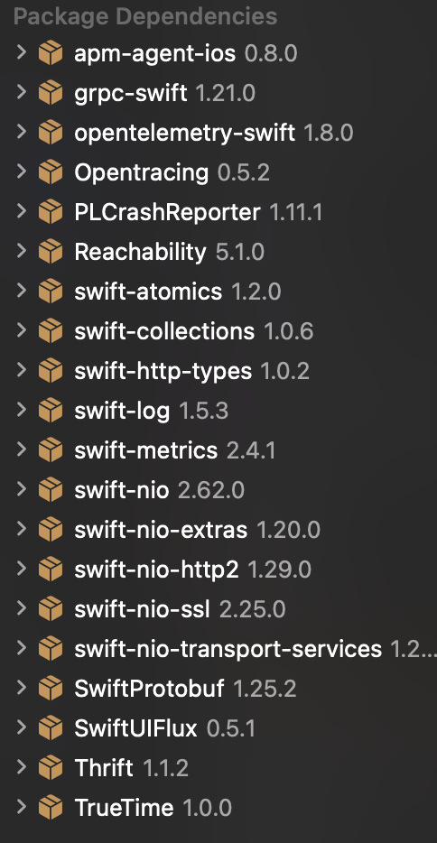

# iOS Installation

[TOC]

## Install XCode

In order to showcase the RUM integration within iOS, we will leverage iOS XCode simulator capabilities to emulate an iOS environment.

Please follow the following steps:

1. Install [XCode](https://apps.apple.com/us/app/xcode/id497799835?mt=12) through Apple App Store
2. Download & Install iOS Platform : Go to XCode -> Navigate to Settings -> Platforms -> Select iOS
3. Add an Apple Account to your Xcode preferences : Got to Xcode -> Settings -> Accounts -> "+" This is necessary to build and sign the generated package.

We have the requirements to show case the RUM integration.

## Demo application

### Download the application repository

First download the application from the following repository

```bash
git clone git@github.com:fred-maussion/MovieSwiftUI
```

Open the downloaded repository in XCode.

### Select the destination build

In this demo we are going to use the simulator to showcase our instrumented application, so for this select the expect iOS simulator device version you want to. For this go to "product" -> Destination -> iPhone 15 and it will download the latest runtime version of iOS for iPhone15.

! Note : If you want to have more iOS version you can hit the "+" button and download the version you want to demo on.

Now you can build the project by hitting the play button at the top.

The first time you build the project it will complain that the version of the project is old and ask to update it. You can safely do it.

### Add the APM Dependency

Now the application is building, we are going to add the Elastic APM package as a dependency in our project. For this you will have to update Package dependencies under repositoy project:
MovieSwift -> Packages -> UI -> Package.swift

! Note : Documentation is wrong, _name_ statement under dependencies is not supported

```swift
// swift-tools-version:5.1
// The swift-tools-version declares the minimum version of Swift required to build this package.

import PackageDescription

let package = Package(
    name: "UI",
    platforms: [
        .iOS(.v13),
        .macOS(.v10_15),
        .tvOS(.v13),
        .watchOS(.v6)
    ],
    products: [
        .library(name: "UI", targets: ["UI"]),
    ],
    dependencies:[
        .package(
            url: "https://github.com/elastic/apm-agent-ios.git",
            from: "1.0.0"),
    ],
    targets: [
        .target(
            name: "UI",
            dependencies: [
                .product(name: "ElasticApm", package: "apm-agent-ios")
            ],
            path: "Sources")
    ],
    swiftLanguageVersions: [
        .version("5.2")
    ]
)

```

Once downloaded you will see XCode download all the dependcies from the elastic-apm-ios agent


Now we are going to instrument the code.

Change the following code :
MovieSwift -> MovieSwift -> views -> components -> home -> Homeview

And modify the code to reflect the following changes as per _Elastic Modification Comments_:

```swift
import SwiftUI
import SwiftUIFlux
// Elastic Modification : import module
import ElasticApm
// End Elastic Modification

// MARK:- Shared View

let store = Store<AppState>(reducer: appStateReducer,
                            middleware: [loggingMiddleware],
                            state: AppState())
// Elastic Modification : Setup the configuration of the iOS Elastic Agent APM
class AppDelegate : NSObject, UIApplicationDelegate {
    func application(_ application: UIApplication, didFinishLaunchingWithOptions launchOptions: [UIApplication.LaunchOptionsKey : Any]? = nil) -> Bool {
        if let serverURL = URL(string: "https://ELASTIC_APM_ENDPOINT:443") {
            let config = AgentConfigBuilder()
                .withServerUrl(serverURL)
                .withSecretToken("ELASTIC_APM_TOKEN")
                .build()
            
            ElasticApmAgent.start(with: config)
        }
        return true
    }
}
// End Elastic Modification
@main
struct HomeView: App {
    // Elastic Modification : Load the Agent
    @UIApplicationDelegateAdaptor(AppDelegate.self) var appDelegate
    // End Elastic Modification
```

### Build the application

Finally you can build the application again who will be updated to your simulator device.
Perform a couple of action and you will see the traces appears on the APM of your ESS deployement. 

## Additional Notes

### Change iOS version or device

If you want to change your iOS version or device, before you build, your need to go to:
Product -> Destination -> Manage Destination -> Select the device you want to build on.

Now if you want to change the version of a device, your need to go to:
Product -> Destination -> Manage Destination -> Hit "+" and select the Device + OS Version you want to test on.

## Reference

- [Apple Simulator](https://developer.apple.com/documentation/xcode/installing-your-app-in-many-simulator-platforms-and-versions)